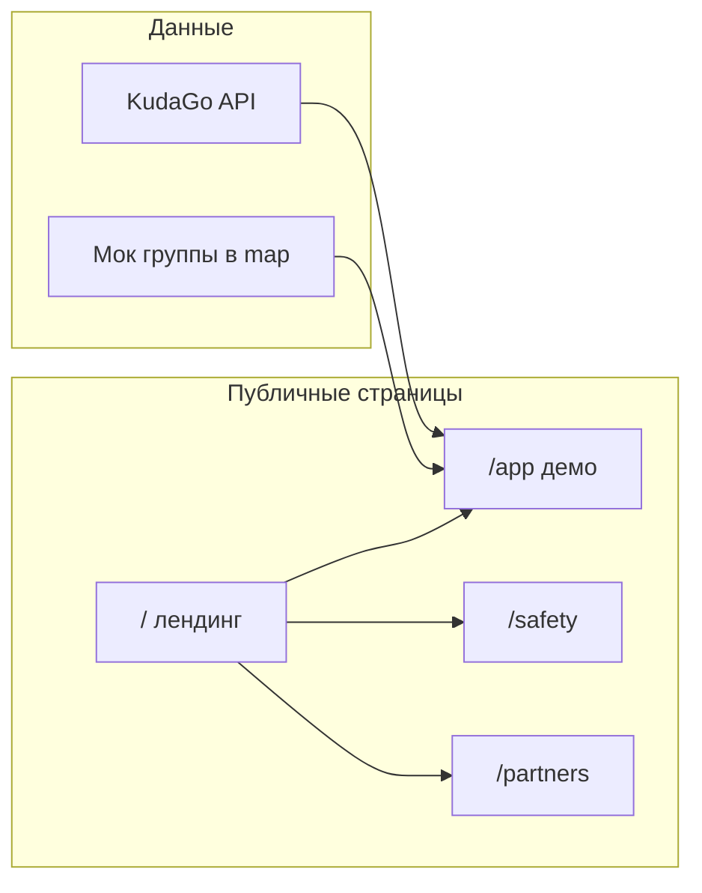

# План изменений сайта ДВИГ по замечаниям

> Черновик для ревью. См. также [PROJECT.md](./PROJECT.md).

## Цель и границы

**Цель:** сделать сайт убедительным для «некодеров» и социально тревожной ЦА — без ложных обещаний backend-функций, с явным разделением **демо** vs **roadmap**.

**В scope (только фронтенд, без БД/auth):**
- Копирайт и структура страниц по [PROJECT.md](./PROJECT.md)
- Честные бейджи («Демо», «по описанию организатора», «источник: KudaGo»)
- Мок социального слоя (группа, места, модератор) поверх реальной афиши
- Информационные страницы: безопасность/данные, партнёрам

**Вне scope (явно не делаем в этом этапе):**
- Реальная верификация, тревожная кнопка с эскалацией, удаление на сервере
- Бэкенд заявок, чаты, модераторская панель
- Интеграция LLM API (оставляем локальный текст из `src/lib/kudago/map.ts`)
- Публичные KPI и опросы «меньше одиноко»

---

## 1. Общая навигация и шапка

**Проблема:** сейчас нет ссылок на демо, безопасность, партнёров; футер лендинга — одна строка (`src/app/page.tsx`).

**Действия:**
- Вынести переиспользуемый компонент, например `src/components/site-header.tsx` + `src/components/site-footer.tsx`:
  - Логотип → `/`
  - «Попробовать демо» → `/app`
  - «Безопасность и данные» → `/safety`
  - «Партнёрам» → `/partners`
  - Бейдж «Демо · СПб»
- Подключить header/footer на лендинге, `/app` (в `event-browser.tsx` или `src/app/app/page.tsx`), новых страницах.

**Метаданные:** обновить `src/app/layout.tsx` — title/description без двусмысленного «ИИ»; указать, что это демо пилота.

---

## 2. Лендинг `/` — позиционирование и доверие

**Файл:** `src/app/page.tsx`

| Блок | Содержание (из PROJECT.md) |
|------|----------------------------|
| Hero (дополнить) | CTA «Открыть демо» → `/app`; подзаголовок: **не dating**, «дело → люди → офлайн» |
| «Не рыночные знакомства» | 2–3 предложения: витрина анкет vs совместное дело; романтика не афишируется |
| «Как это работает» (3 шага) | 1) Выбери интерес / событие → 2) Группа и заявка (демо) → 3) Офлайн в публичном месте |
| «Почему не афиша» | JTBD «пойти не с кем»; KudaGo даёт «куда», ДВИГ — «с кем» (roadmap) |
| «Для кого» | 18–28, приезжие, интроверты — коротко |
| B2B-тизер | 4 пункта выгод партнёра + ссылка «Подробнее» → `/partners` |
| Футер | Ссылки: Демо, Безопасность, Партнёрам; строка «Афиша: KudaGo · Социальный слой: демо» |

Визуально — те же `dvig-*` классы из `src/app/globals.css`, без новой дизайн-системы.

---

## 3. Страница `/safety` — безопасность и цифровой след

**Новый файл:** `src/app/safety/page.tsx` (статический контент).

Структура (синхрон с разделом «Безопасность» в PROJECT.md и существующими моками в `SafetyPanel` / `ProfilePanel`):

1. **Принцип:** безопасность = забота + прозрачность, не «алгоритм защитит».
2. **До встречи:** верификация, цели в профиле, состав группы, одобрение заявки — статус **в разработке**.
3. **На встрече:** только публичные места; группы от N человек на старте; чек-ин, доверенный контакт, тревожная кнопка — **показано в демо `/app` → Настройки**, без реальной отправки.
4. **Данные:** что хранится / что удаляется / что остаётся обезличенно (перенести буллеты из `ProfilePanel`).
5. **Выход:** экспорт, удаление профиля, срок хранения жалоб — roadmap + ссылка на демо-кнопки.
6. **Ограничение MVP:** жёлтый callout как в `SafetyPanel`.
7. CTA: «Посмотреть в демо» → `/app?view=settings` (опционально query для авто-перехода в настройки).

---

## 4. Страница `/partners` — B2B и B2B2C

**Новый файл:** `src/app/partners/page.tsx`

- Таблица выгод (заполнение слотов, средний чек, аудитория 18–28, меньше рассинхрона афиши) — из PROJECT.md § «Выгоды B2B».
- **B2B2C для редакций:** экономия времени на дайджестах — формулировка **«гипотеза пилота»**, без цифр, пока нет замера.
- Разделение: **`spb-events`** (операции) vs **ДВИГ** (люди) — 2 колонки, без акцента на CLI для посетителя сайта; для партнёра: «веб и мессенджеры, не терминал».
- Контакт пилота: placeholder (email/Telegram команды) — уточнить перед вёрсткой.
- CTA на демо афиши → `/app`.

---

## 5. Демо `/app` — глобальная честность

**Файл:** `src/components/event-browser.tsx`

- **Sticky banner** вверху (все view): «Демонстрационный интерфейс. Заявки, группы и safety — локально в браузере, без сервера.»
- Переименования в UI (не менять имя поля `aiSummary` в типах, только labels):
  - «ИИ-резюме» / «ИИ-резюме готово» → **«Кратко о событии»** + подпись **«по описанию организатора / KudaGo, не нейросеть»**
  - В настройках: «ИИ-резюме / Демо-режим» → «Краткое описание / Локальный текст»
- На карточке и в sheet: блок **«Источник»** — ссылка `event.url`, `updatedAt`, дисклеймер «Проверьте время и цену на сайте организатора».

---

## 6. Мок социального слоя (группы и места)

**Проблема:** в `src/lib/kudago/map.ts` `spotsLeft: 0`, `participants: 0`, `moderator: "—"`; на карточке для KudaGo показываются только лайки — социальный JTBD не виден.

**Действия:**

1. В `mapKudagoEvent` — детерминированный мок от `raw.id`:
   - `groupCapacity` 6–12 (новое поле в `DvigEvent` опционально или переиспользовать `spotsLeft`/`participants`)
   - `participants` = 1–4 уже «в группе»
   - `spotsLeft` = capacity - participants
   - `moderator` = «Организатор группы (демо)» вместо «—»

2. **EventCard / EventSheet:**
   - Строка: `В группе N · свободно M · до K человек`
   - Бейдж «Публичное место» если есть адрес
   - В sheet: мок-аватары участников (2–3 инициала) + пометка «демо»

3. **Фильтр** в панели фильтров:
   - Чекбокс «Есть свободные места в группе» → `spotsLeft > 0`

4. **Кнопка «Подать заявку»:**
   - Toast или inline-текст: «В демо заявка сохраняется только у вас в браузере»

---

## 7. Усиление существующих панелей (без нового backend)

| Место | Изменение |
|-------|-----------|
| `SafetyPanel` | Заголовок + ссылка «Полная политика» → `/safety`; уточнить, что кнопки не отправляют сигнал |
| `ProfilePanel` | То же → `/safety#data`; бейдж «Демо» |
| `SettingsPanel` | Карточка «Данные / KudaGo» + «Социальный слой / демо»; убрать впечатление production LLM |
| `Event detail` safety checklist | Явно: «группа от N», «не 1-на-1 на первом этапе» (текст из PROJECT.md про Алину) |
| `FriendsView` | Оставить «мок», добавить одну фразу про будущий социальный граф |

---

## 8. Конкуренты и «мы / не мы» (лёгкий блок)

Не отдельная страница — **секция на лендинге** или collapsible на `/app` внизу списка (опционально):

- 3 колонки: Dating / Афиша / ДВИГ
- Одна фраза позиционирования из PROJECT.md

---

## 9. Технические детали реализации

| Задача | Подход |
|--------|--------|
| Новые страницы | App Router: `safety/page.tsx`, `partners/page.tsx`, общий layout с header |
| Deep link в настройки | `?view=settings` — парсинг в `EventBrowser` `useEffect` + `setView("settings")` |
| Стили | Переиспользовать `dvig-page`, `dvig-panel`, существующие UI-компоненты |
| i18n | Только русский, как сейчас |
| SEO | `metadata` на каждой новой странице |

**Оценка объёма:** ~6–8 файлов (2 новых страницы, 2 layout-компонента, правки `page.tsx`, `event-browser.tsx`, `map.ts`, `events.ts`).

---

## 10. Чек-лист приёмки (ручная проверка)

- [ ] С лендинга за 1 клик попасть в `/app`; виден баннер «Демо»
- [ ] Нигде нет «ИИ готово» без пояснения про локальный/KudaGo текст
- [ ] На карточке KudaGo-события видны группа/места (мок), не только ♥/💬
- [ ] `/safety` и `/partners` открываются, согласованы с PROJECT.md
- [ ] Футер/шапка одинаковы на всех страницах
- [ ] Мобильная вёрстка: hero + 3 шага + CTA не ломаются
- [ ] `npm run build` проходит без ошибок

---

## Связь с замечаниями ревьюеров

| Замечание | Как закрываем на сайте |
|-----------|-------------------------|
| Нет UX для «некодеров» | Лендинг 3 шага + CTA; убрать акцент на CLI с публичных страниц |
| B2B без выгод | `/partners` + тизер на лендинге |
| Слабо «пойти не с кем» | Копирайт + мок групп/мест |
| Безопасность vs метарамка | `/safety` + честные подписи в демо |
| KudaGo single point | Блок «источник + проверьте на сайте»; не скрывать зависимость |
| ИИ / ответственность | Переименование + дисклеймер факт/текст |
| Алина 1-на-1 | Текст «группа от N», публичное место |
| KPI / экология | Не на публичном сайте (осознанно вне scope) |
